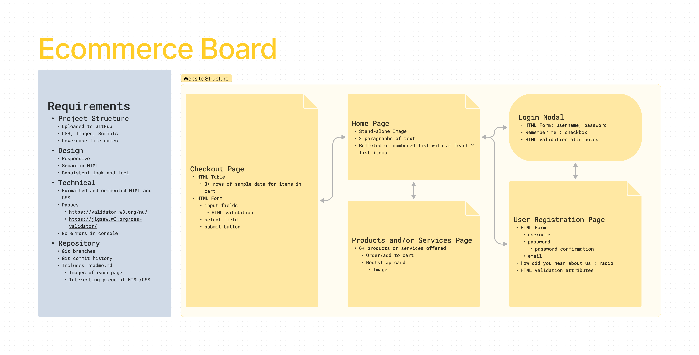
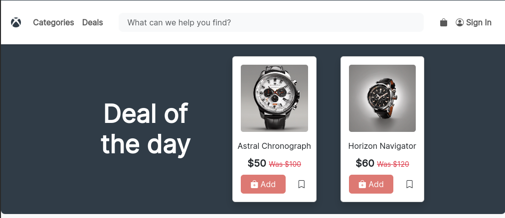
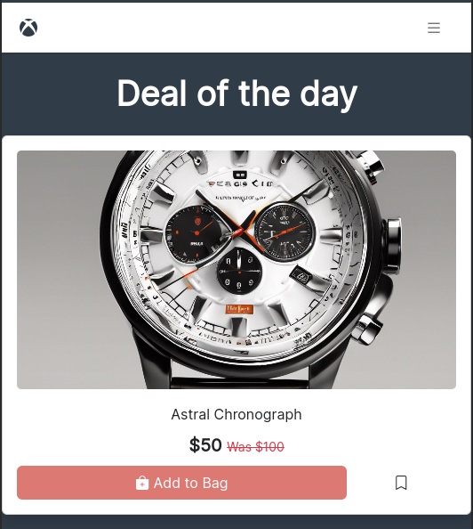
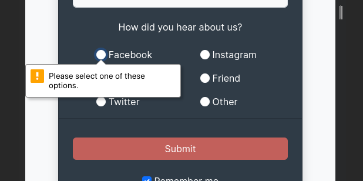
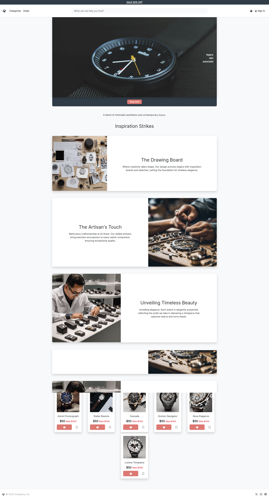
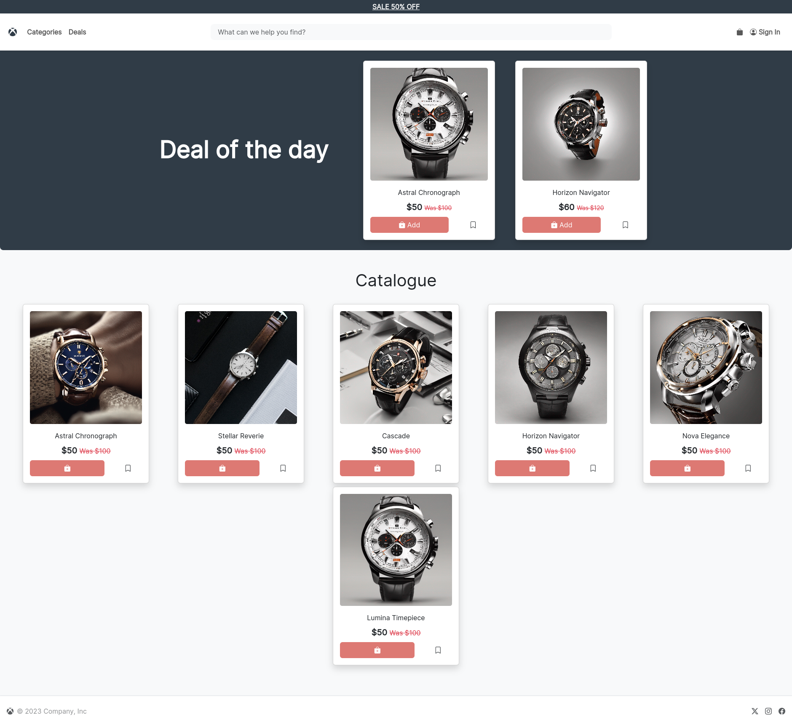
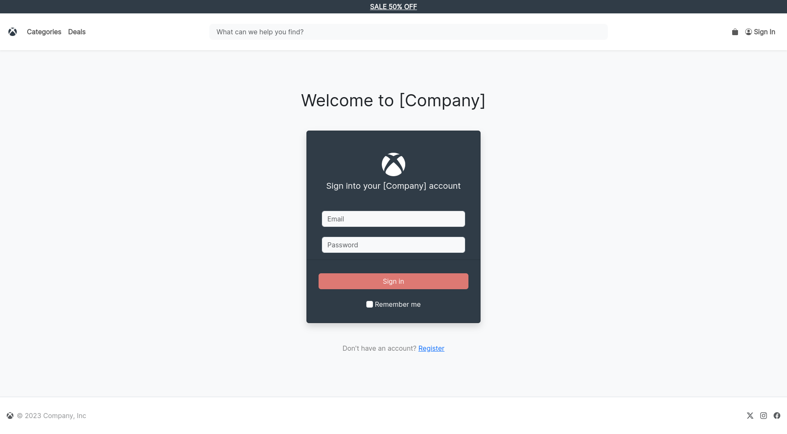
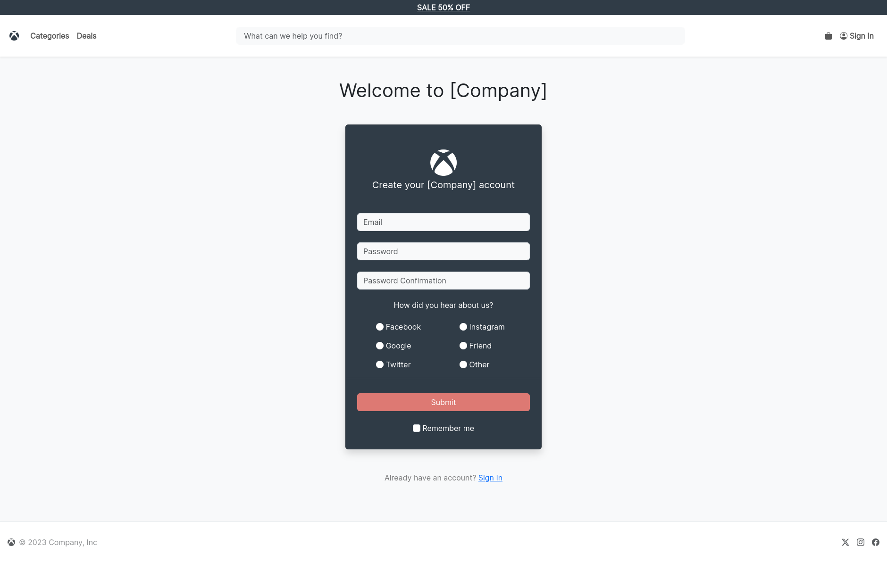
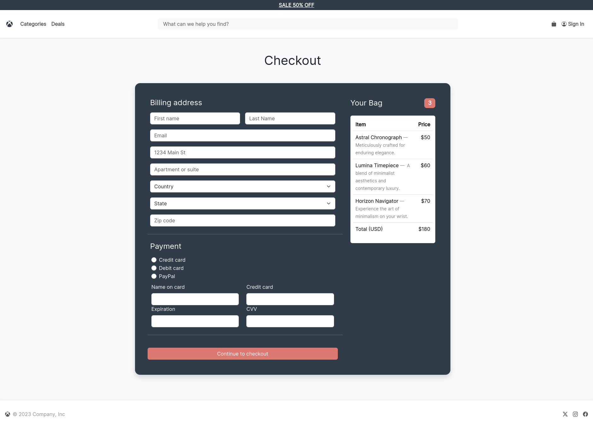

# Capstone 1: Ecommerce

Modern and responsive ecommerce frontend built purely in CSS HTML and Bootstrap

[Live Site](https://joncgroberg.github.io/CapstoneOne_Ecommerce/)

# Table of contents

- [Capstone 1: Ecommerce](#capstone-1-ecommerce)
- [Table of contents](#table-of-contents)
- [Development Process](#development-process)
- [Key Features](#key-features)
  - [Image Grid](#image-grid)
  - [Hero Image \& Navbar](#hero-image--navbar)
    - [Before](#before)
    - [After](#after)
  - [Validation](#validation)
- [Pages](#pages)
  - [Landing](#landing)
  - [Store](#store)
  - [Login](#login)
  - [Register](#register)
  - [Checkout](#checkout)
- [About the project](#about-the-project)
    - [Technologies Used](#technologies-used)
    - [Credits \& Inspiration](#credits--inspiration)

# Development Process

- Diagram built with [Figma]("https://www.figma.com/file/S2n1eDcWJ2ht2EFfM9nrPH/Ecommerce-Board?type=whiteboard&node-id=0%3A1&t=JVaHlDMqPAjOVueR-1")

# Key Features

## Image Grid

- Images turn into a masonry grid at small sizes
  - Checkout and bookmark icons on small cards change size
- Images scale to fit display size
  

  
  

## Hero Image & Navbar

- Button text shortens in larger views
- Navbar collapses
- Hero Image expands to fill mobile screen

### Wide Device

  

  
  

### Mobile

  

  
  

## Validation

  

  
  

# Pages

## Landing

## Store

## Login

## Register

## Checkout

# About the project

### Technologies Used

- [CSS](https://developer.mozilla.org/en-US/docs/Web/CSS)
- [HTML](https://developer.mozilla.org/en-US/docs/Learn/Getting_started_with_the_web/HTML_basics)
- [Bootstrap](https://getbootstrap.com/)
- [Figma](https://www.figma.com/) (wireframing and planning)
- [Stable Diffusion](https://stablediffusionweb.com/) (used in image generation)
- [Claude-instant-100k](https://www.anthropic.com/) (used in paragraph generation)

### Credits & Inspiration

- [Amazon](https://www.amazon.com/)
- [Target](https://www.target.com/)
- [AppleStore](https://www.apple.com/store?afid=p238%7CsHI7bHWVr-dc_mtid_1870765e38482_pcrid_675348649381_pgrid_13945964767_pntwk_g_pchan__pexid__&cid=aos-us-kwgo-brand-apple-store--slid---product-)
